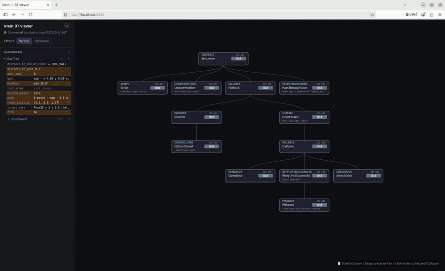

# klein

A lightweight, self-contained CLI that streams live **BehaviorTree.CPP v4**
telemetry to an interactive browser dashboard.

klein connects to a running robot node over ZeroMQ — speaking the Groot2
publisher wire protocol that ships with BehaviorTree.CPP — recursively unrolls
nested subtrees into a single tree, and streams 10 Hz status telemetry plus live
blackboard values to an interactive **D3.js** dashboard in your browser.



## Install

klein is a command-line tool, so [pipx](https://pipx.pypa.io) is the tidiest way
to install it into its own isolated environment. It isn't on PyPI yet, so
install it straight from GitHub:

```bash
pipx install git+https://github.com/johanubbink/klein-bt.git
```

This installs two commands: `klein-bt` (the dashboard) and `klein-bt-mock`
(a fake robot for testing).

## Usage

```bash
klein-bt                    # connect to a robot on 127.0.0.1:1667, open the dashboard
klein-bt --robot-host 10.0.0.5 --robot-port 1667
klein-bt --port 8080 --no-browser
```

| Flag            | Default     | Meaning                                        |
| --------------- | ----------- | ---------------------------------------------- |
| `--robot-host`  | `127.0.0.1` | IP of the C++ robot node                       |
| `--robot-port`  | `1667`      | ZeroMQ REQ/REP port on the robot               |
| `--port`        | `8080`      | klein's dashboard + telemetry port (HTTP & WS) |
| `--no-browser`  | off         | don't auto-open the system browser             |

klein prints a clickable `http://localhost:<port>` link and opens it
automatically. The dashboard supports zoom/pan, click-to-collapse subtrees, and
live per-node status coloring (green SUCCESS, pulsing amber RUNNING, red
FAILURE, slate IDLE). The **Layout** control switches between a vertical tree
(root at the top, the BT convention) and a horizontal one. D3.js is vendored
locally, so the dashboard works on air-gapped robot networks with no internet
access.

The side pane collapses with the `«` button when you want the canvas to itself,
and comes back with the handle it leaves behind.

### Blackboards

The pane's **Blackboards** section lists every subtree's board, refreshed at 2 Hz
while the tree runs, in tree order and indented the way the tree nests. A row
flashes amber when its value changes; clicking one unwraps it, and ROS message
types klein has a renderer for collapse to a single readable line
(`151 poses · map · 12.4 m`). Hovering a board highlights its node on the canvas.

See [docs/blackboards.md](docs/blackboards.md) for the full tour: how each value
is formatted, what `(not shown)` means, and how to add a renderer for your own
message type.

## Documentation

- [docs/architecture.md](docs/architecture.md)
- [docs/protocol.md](docs/protocol.md)
- [docs/blackboards.md](docs/blackboards.md)

## Testing without a robot

`klein-bt-mock` is a small fake publisher that speaks just enough of the wire
protocol to drive the dashboard with no real robot (it ships with the package):

```bash
klein-bt-mock --port 1777             # in one shell
klein-bt --robot-port 1777            # in another
```

Run the unit tests (no extra dependencies — stdlib `unittest`):

```bash
python -m unittest discover -s tests -t .
```

## License

klein is released under the MIT License — see [LICENSE](LICENSE).

The dashboard bundles [D3.js](https://d3js.org) v7 (ISC License, © Mike
Bostock), served locally so it works on air-gapped networks.

## Disclaimer

klein is an independent tool. It is not affiliated with, endorsed by, or
sponsored by the BehaviorTree.CPP project or the authors of Groot / Groot2.
"BehaviorTree.CPP", "Groot", and "Groot2" are the property of their respective
owners. klein interoperates over the Groot2 publisher wire protocol that is part
of the open-source, MIT-licensed BehaviorTree.CPP library; it contains no code
copied from those projects.
