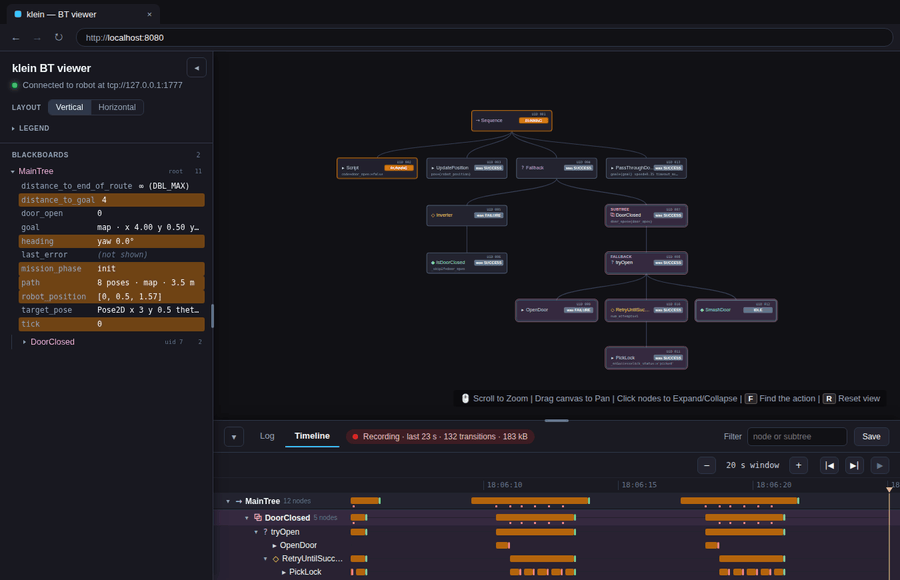

# klein

klein lets you watch a running BehaviorTree.CPP v4 tree live in your browser.
You see which nodes are running, succeeding or failing, plus the current
blackboard values, as the robot ticks.



## Install

klein isn't on PyPI yet, so install it from GitHub with [pipx](https://pipx.pypa.io):

```bash
pipx install git+https://github.com/johanubbink/klein-bt.git
```

This gives you two commands: `klein-bt` (the dashboard) and `klein-bt-mock`
(a fake robot for trying it out).

## Run it

```bash
klein-bt                                          # robot on 127.0.0.1:1667
klein-bt --robot-host 10.0.0.5 --robot-port 1667  # robot somewhere else
klein-bt --port 8080 --no-browser                 # don't open a browser
klein-bt --open run.btlog                         # a saved recording, no robot
```

| Flag              | Default     | Meaning                              |
| ----------------- | ----------- | ------------------------------------ |
| `--robot-host`    | `127.0.0.1` | IP address of the robot              |
| `--robot-port`    | `1667`      | Groot2 publisher port on the robot   |
| `--port`          | `8080`      | port the dashboard is served on      |
| `--no-browser`    | off         | don't open the browser automatically |
| `--record-buffer` | `10m`       | how much recent history to record (`90s`, `30m`, `1h`); `0` turns recording off |
| `--open FILE`     |             | show a saved `.btlog` (and `FILE.bb.jsonl` beside it) instead of a robot |

klein opens `http://localhost:8080` for you. You can start it before the robot
is up; it keeps retrying until the robot appears.

## Using the dashboard

- Node colours show status: green is SUCCESS, pulsing amber is RUNNING, red is
  FAILURE, grey is IDLE.
- Scroll to zoom and drag to pan. Click a node to fold or unfold its children.
- Press `R` to see the whole tree again, or `F` to jump to whatever is running.
- Hover a node to see its ports.
- **Layout** switches between a vertical and a horizontal tree.
- The **Blackboards** list shows every subtree's values. A value that just
  changed gets a thin amber edge that fades; a key that changes all the time
  (a position, a counter) gets a steady dim edge and a `~` instead. Click a
  row to expand it, or hover a board to find its node in the tree. See
  [docs/blackboards.md](docs/blackboards.md) for how values are shown.
- Hover a key to see which nodes use it: writers outlined solid, readers
  dashed. Hover a node to ring its keys. Writers get a small amber dot when
  the key changes.
- Drag the side panel's right edge to make it wider or narrower, or fold it
  away with its `◂` button (or a double-click on the edge) for more room.
  klein remembers both.

If the robot loads a different tree, the dashboard switches to it by itself.

## Record, rewind and replay

klein records everything the robot does (BehaviorTree.CPP 4.3.3 or newer),
blackboard included, and keeps the last 10 minutes. Change that with
`--record-buffer` (`30m`, `1h`, or `0` to turn recording off). Don't log
from Groot2 against the same robot at the same time: each would get only
some of the transitions.


The drawer under the tree shows the recording. Its top row works in every
tab, even with the drawer folded:

- |◀ ▶| step to the previous or next transition, and ▶ plays at 1×.
  While live it reads ❚❚: press it to freeze the tree, the blackboard and
  the clock right where they are.
- The green **● Live** says you are live. In the past it turns into
  **Jump to live**, which takes you back; the tree gets a thin amber edge,
  and the clock beside the bar says which moment you see. Changes are marked
  in the past too: stepping or clicking shows which values just changed.
- The bar is the whole recording, from the oldest moment kept to now.
  Click or drag it to go anywhere. Hatched stretches are outages, and a pink
  dashed line marks where the robot started another tree. On the Timeline
  tab a box on it shows the Timeline's window: drag it to pan, or drag its
  edges to zoom.
- The keys: ←/→ step, Space plays or pauses, Home goes to the oldest moment
  kept, End or Esc goes live, and `\` zooms the Timeline to fit everything
  kept (also its ⤢ button).

Below it are two tabs, a filter and the recording pill:

- **Log**: every transition. Click a row to see the tree and blackboard at
  that moment.
- **Timeline**: each node's running time as bars, so every retry shows. Drag
  the playhead to go back in time; − and + change the window.
- The **Filter** beside the tabs narrows both tabs, and stepping, to the
  nodes and subtrees you name.
- **Save**, on the recording pill (`● Recording 10 min · 148 kB`),
  downloads one `.zip` with a `.btlog` per tree run (Groot2 opens these)
  and its blackboard in a `.bb.jsonl` beside it.

`klein-bt --open FILE.btlog` shows a saved recording without a robot, in the
same Log and Timeline; **Jump to end** takes you to its end. Unzip a saved
`.zip` first; the `.bb.jsonl` beside the file brings its blackboard along.

## Set up your robot

klein talks to the Groot2 publisher that comes with BehaviorTree.CPP v4. If
Groot2 can connect to your robot, klein can too. If not, add a publisher after
you create the tree:

```cpp
#include "behaviortree_cpp/loggers/groot2_publisher.h"

auto tree = factory.createTreeFromFile("my_tree.xml");
BT::Groot2Publisher publisher(tree, 1667);
```

The publisher also uses the next port up (1668), so leave that one free.

## Try it without a robot

```bash
klein-bt-mock --port 1777        # in one terminal
klein-bt --robot-port 1777       # in another
```

Add `--switch-every 200` to the mock to make it swap between two trees every
20 seconds or so.

## Docs

- [docs/blackboards.md](docs/blackboards.md): reading blackboard values, and
  adding a renderer for your own message types.
- [docs/architecture.md](docs/architecture.md): how klein works inside.
- [docs/protocol.md](docs/protocol.md): the Groot2 wire protocol klein speaks.
- [docs/testing.md](docs/testing.md): the test tiers and harness, and
  `scripts/make_gifs.py`, which remakes the GIFs above.

## License

klein is released under the MIT License — see [LICENSE](LICENSE).

The dashboard bundles [D3.js](https://d3js.org) v7 (ISC License, © Mike
Bostock), served locally so it works on air-gapped networks.

## Disclaimer

klein is an independent tool. It is not affiliated with, endorsed by, or
sponsored by the BehaviorTree.CPP project or the authors of Groot / Groot2.
"BehaviorTree.CPP", "Groot", and "Groot2" are the property of their respective
owners. klein interoperates over the Groot2 publisher wire protocol that is part
of the open-source, MIT-licensed BehaviorTree.CPP library; it contains no code
copied from those projects.
